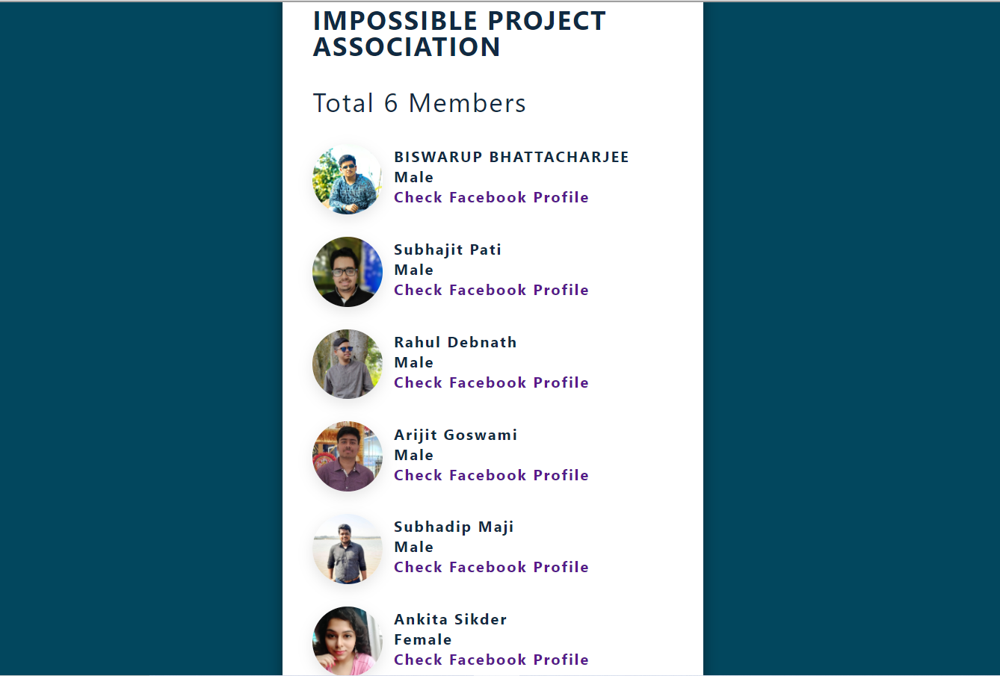
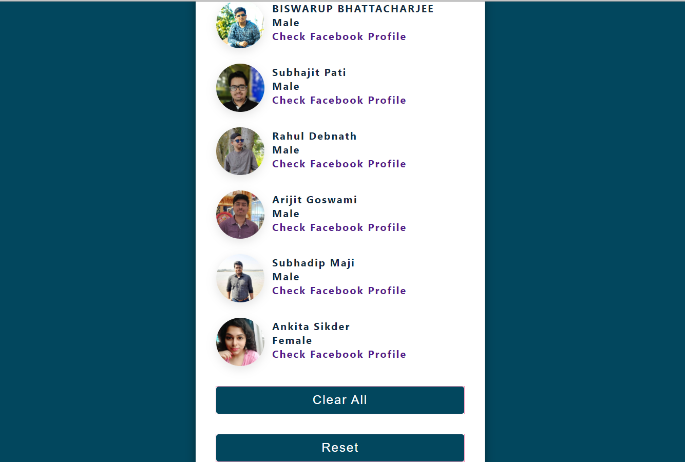

# SIMPLE-FRIENDLIST-REACTBASICS :fire: :sunglasses: :star_struck: :boy: :girl:

 [](https://shields.io/) [](https://shields.io/)  [](https://shields.io/) [](https://shields.io/) [](https://shields.io/) 

***This new WebPage named 'IPA-MEMBERS' is created by Biswarup Bhattacharjee, student of BTECH, in University of Engineering and Management, Kolkata.***

**Email Id: bbiswa471@gmail.com.** 

**Contact No: 916290272740.** 


<p align="left">
<a href="https://facebook.com/biswarup.bhattacharjee.5811" target="blank"></a>
<a href="https://instagram.com/biswarup2210" target="blank"></a>
<a href="https://github.com/biswa2210/biswa2210" target="blank"></a>
</p>

## About :point_down: 

<div align="justified">

It is a simple Webpage of a group of students in UEMK, of year 2019-23 studying Btech. The name of the web page is 'IPA-MEMBERS'. Here I have added Facebook Profile link of members of IPA(Impossible Project Association). IPA is a group of Btech students including me which deploys many new projects based on Computer Science. Here in the web page we can clear all the members by clicking on clear all button. If we click on resent then the previous task will be undone. We can also see profile pictures of every group members. It is a very simple web page for our introduction.
      
</div>

 <details>
       <summary>"Click here to read the name of the members'</summary>
 
 ## Members :point_down:
 
 - Biswarup Bhattacharjee<br>
 - Subhajit Pati<br>
 - Rahul Debnath<br>
 - Arijit Goswami<br>
 - Subhadip Maji<br>
 - Ankita Sikder<br>

</details>
 
## LINK : :point_right: https://ipa-members.netlify.app

## Purpose :point_down:

<div align="justified">

I have made this to introduce our group to others.
</div>

## Importance :point_down:

<div align="justified">

If I share the link of this web page then people will know about us. So that this web page is important to easily introduce ourselves.

</div>

## Folder Structure :point_down:
```bash
simple-friendlist-react-basic
       ├── public
       |     └── index.html
       └── src
             ├── App.js
             ├── List.js
             ├── data.js
             ├── index.css
             └── index.js           
```

## Making :point_down:

<div align="justified">

I have made this project using simple concepts of web development like html5, css3, basic react and javascript. 
</div>

## Idea

[https://uidesigndaily.com/](https://uidesigndaily.com/posts/sketch-birthdays-list-card-widget-day-1042)

## Screenshots :point_down: 

<div align="center">
  

<a href="ipa.PNG"></a> 

<a href="ipa1.PNG"></a> 
</div>


